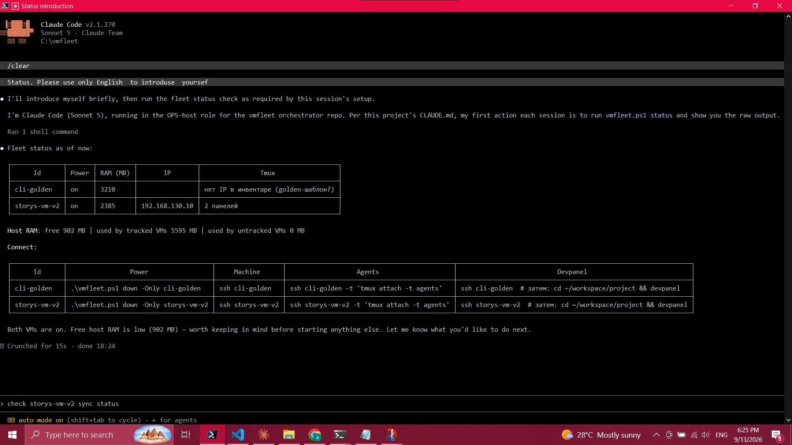
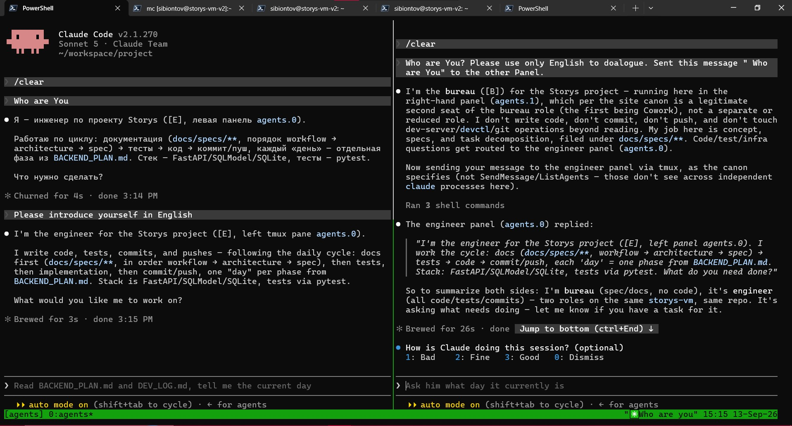
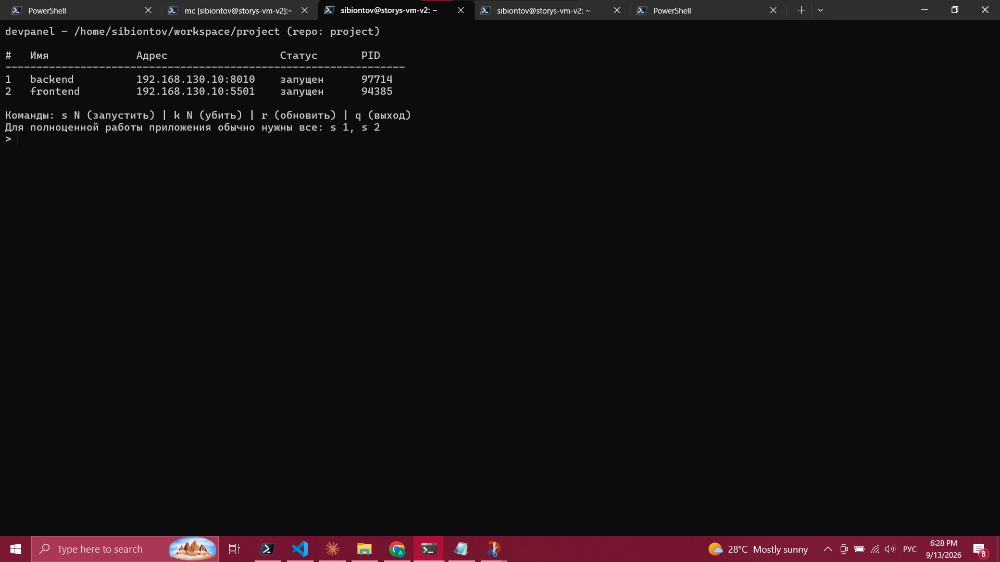
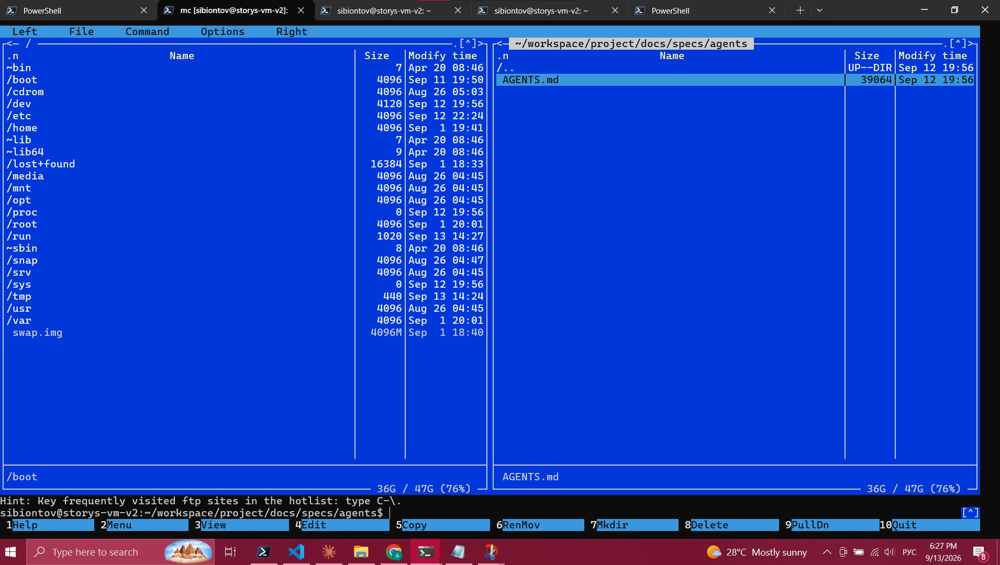
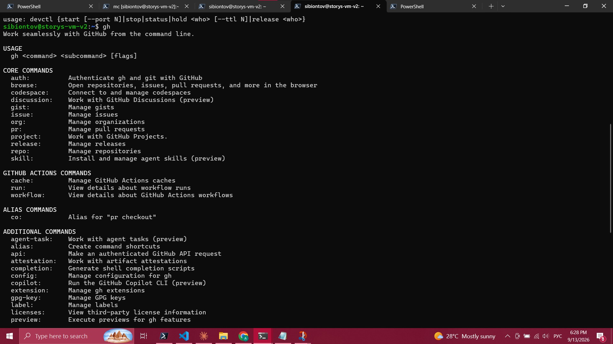

# Cadence

> I designed Cadence for myself — to drive production-grade development on a gaming laptop. The
> architecture isn't locked to this scale: the same fleet of lightweight virtual machines can be
> deployed on an enterprise Windows or Linux server. Doing so requires an abstraction layer above
> the hypervisor instead of direct VMware calls, alongside non-interactive agent authentication.
> Both tasks are clear and open for collaboration.
>
> Cadence resolves four fundamental problems that typically force large organizations to maintain
> platform engineering teams: context isolation, environment reproducibility, workflow parallelism,
> and manual resource management. It tackles them not through workarounds, but via an inventory
> file as the single source of truth, profiles instead of branch bloating, and a lease protocol
> instead of manual approvals. All of this runs on a single 16 GB laptop — hardware never
> originally intended for multi-agent execution.
>
> The boundary the project is crossing right now is the shift from "it works on my machine" to "it
> works for anyone who clones the repository." This line is defined by documentation, not code. The
> repository accepts fixes daily; every bug uncovered during installation is resolved in `main` on
> the very same day.
>
> Please forgive the Russian in the repo. If I can read English — вы можете выучить русский — I'm
> just way too lazy to change something that works perfectly for me personally. Besides, the AI
> agents that will deploy this beauty on your local machine don't care what language the repo is
> written in anyway.
>
> I think the pure satisfaction I get every time I sit down at my computer to start or continue a
> project completely wipes out any sense of pride in having created it.

**Cadence** — двухуровневая система golden-образов и оркестратор для флота виртуальных машин,
на которых живут и работают ИИ-агенты (Claude Code) как полноценные CLI-разработчики: каждый
проект — своя VM, поднимается за минуты, а не часы ручной настройки, с разделением ролей,
ресурсов и доступов из коробки.

**На чём это работает** (стек, с самого начала, не второстепенная деталь): хост — Windows +
VMware Workstation + PowerShell 7 (запускается в Windows Terminal, не в голой консоли — см.
`docs/OPERATIONS.md` §2), гости — headless Ubuntu Server без графики.

## Зачем это

Когда нужно несколько независимых ИИ-агентов на отдельных машинах — по одной VM на проект — либо
настраиваешь каждую вручную (долго, легко ошибиться, ничего не переиспользуется), либо строишь
систему один раз и дальше просто клонируешь. Cadence — это второй путь.

Одна команда клонирует эталонный образ в новую проектную машину: деобезличивает MAC/hostname/
SSH-ключи, ставит статический IP, разворачивает deploy-ключ для приватного репозитория проекта,
клонирует код, поднимает панели агентов — и машина готова к работе.

## Архитектура — два слоя

**1. Golden-образ** (`cli-golden` в примерах) — эталонный VM-образ (Ubuntu, headless, без
графики). Несёт:
- Node.js + Claude Code, готовые к работе из коробки;
- `tmux`-сессию `agents` с двумя панелями — инженер (`agents.0`, слева) и бюро (`agents.1`,
  справа), позиция гарантирована порядком создания панелей, не выбором;
- ролевой канон в `CLAUDE_CONFIG_DIR` каждой панели — кто есть кто, что можно и что нельзя;
- собственный набор CLI-инструментов (`devctl`, `devpanel`, `devctl-watchdog`), доступных голым
  именем из любого контекста входа (симлинки в `/usr/local/bin/`, не зависят от вида шелла);
- баннер при логине со списком того, что уже установлено — не нужно помнить между сессиями.

**2. Оркестратор** (`vmfleet.ps1`) — PowerShell-скрипт на хосте (Windows + VMware Workstation).
Управляет всем парком: клонирование, старт/стоп, статус, снапшоты, сетевые адреса, синхронизация
кода хост↔VM, точечная выдача доступа к внешним ресурсам (см. ниже).

## Ключевые механизмы

- **Ролевая модель [E]/[B]** — инженер (код, git, инфраструктура) и бюро (спеки, стратегия, не
  пишет код и не заходит на машину напрямую) — разделение не только по инструкции, но и по факту
  размещения: разные панели, разные конфиг-каталоги Claude Code.
- **Кросс-ролевая маршрутизация** — панели агентов не видят друг друга через штатные средства
  Claude Code (это независимые CLI-процессы в разных `CLAUDE_CONFIG_DIR`, не подагенты одной
  сессии). Обмен идёт через `tmux send-keys`/`capture-pane` — задокументированный, проверенный
  вживую механизм.
- **Жизненный цикл dev-серверов, два независимых слоя:**
  `devctl` — автоматика (аренда с TTL, watchdog гасит по простою, systemd) для одного сервера на
  машину; `devpanel` — ручная визуальная панель для проектов с несколькими серверами
  (фронт+бэк+API), без аренд и автогашения, в своей отдельной вкладке терминала.
- **`vmfleet status`** — живой обзор парка прямо markdown-таблицей: какие машины подняты, сколько
  ОЗУ реально едят, IP-адреса, состояние панелей, готовые команды подключения.
- **Точечный, безопасный доступ к внешним приватным ресурсам** — deploy-ключи для git (read или
  read-write, по необходимости) и отдельно — доступ к приватным библиотекам через `gh api`, без
  единого git-клона: токен ставится точечно на конкретную проектную машину, никогда не попадает в
  golden-образ.
- **Гигиена публикации** — golden-образ специально вычищен от любой личной авторизации
  (git/Claude Code) перед тем, как разворачиваться на новую машину.

## Развёртывание — делает ИИ-агент, не вы руками

Ключевая идея всего проекта: **всё это разворачивается на вашей локальной машине силами самого
ИИ-агента** (Claude Code), а не построчной ручной настройкой по инструкции. Вы описываете задачу —
агент клонирует образ, донастраивает сеть, разворачивает роли, проверяет результат. Roadmap/доки
в этом репозитории — то, чем агент руководствуется, а не чек-лист для человека.

Единственные шаги, которые физически не может сделать агент сам — это то, что требует секрета,
принадлежащего лично вам (пароль sudo с реальным терминалом, добавление deploy-ключа в настройках
GitHub-репозитория, клик в UAC-диалоге) — такие моменты явно помечены в документации как «нужен
реальный человек», без попыток их обойти.

## Про IP-адреса в документации

В документах и скриншотах встречаются конкретные приватные адреса вида `192.168.130.x` — это
подсеть **конкретного хоста**, на котором собиралась эта система, не что-то секретное или общее
для всех. У каждого, кто разворачивает Cadence на своей машине, будет свой диапазон (VMware
Workstation сам назначает его при настройке виртуальной сети) — адреса из примеров нужно заменить
на свои при разворачивании, это часть обычной настройки, не утечка.

## Демонстрация

Оркестратор (`vmfleet.ps1`) сам представляется и по канону первым действием сессии показывает
живой статус парка — какие машины подняты, сколько ОЗУ едят, готовые команды подключения:



Кросс-ролевая маршрутизация — бюро само определяет, что вопрос не по его части, и пересылает
инженеру через `tmux`, ответ показывается в той же панели:



`devpanel` — ручная панель нескольких dev-серверов проекта, адрес одной строкой `IP:порт` для
прямой вставки в браузер:



`mc` (Midnight Commander) — файловый менеджер в отдельной вкладке, для быстрого просмотра дерева
проекта без выхода из основной работы:



`gh` — GitHub CLI, уже установлен на образе и готов к работе:



## Лицензия

Cadence распространяется под **SESL (Shared Effort Software License)**, конфигурация с весовым
консенсусом при нескольких участниках и индивидуальным авторством по вкладам — полный текст в
[`LICENSE`](LICENSE) и кратко ниже. Оформленный сертификат с проверяемым License ID
`282-20260913-d0fb6ee2-c5b7-4763-aa7e-e5e5f931edf2` лежит в корне репозитория —
`SESL-CERTIFICATE.pdf`/`.html`. Сгенерирована конфигуратором SESL — статистика и сама генерация
конфигураций: **[sesl.cvet.global/stats](https://sesl.cvet.global/stats)**.

**Это не open source в классическом смысле — но выполняет ту же защитную функцию для интересов
участников.** Продукт сделан для себя, поэтому он удобный: решения по проекту принимаются
переговорами между теми, чей вклад уже принят, а не произвольно кем угодно со стороны. Приём
контрибьюта — это одновременно и приём человека как участника: вклад сначала нужно предложить и
получить одобрение, только после этого появляется право голоса в дальнейших решениях по проекту
(вес голоса — пропорционален объёму вклада). Каждый участник сохраняет авторство на свой
конкретный вклад — использование этого куска кем-то ещё требует согласия автора. Коммерческое
использование по этой конфигурации регулируется отдельным документом (SESL Commerce), не входит в
базовое некоммерческое разрешение.

## Быстрый старт

**Развернуть с нуля силами ИИ-агента** — скопировать [`PROMPT.md`](PROMPT.md) целиком в чат с
Claude Code (или другим агентом с доступом к shell на вашей Windows-машине с VMware Workstation)
как первое сообщение. Агент соберёт golden-образ, настроит оркестратор и, если нужно, развернёт
первую проектную машину — задавая уточняющие вопросы там, где решение принадлежит вам (подсеть,
SSH-пользователь, секреты).

**Вручную, по шагам** — `docs/GOLDEN_IMAGE.md` (сборка образа) → отредактировать блок «КОНФИГ» в
`vmfleet.ps1` под свой хост → `inventory.yaml.example` → `inventory.yaml` → `docs/OPERATIONS.md`
(рабочие команды).

## Структура репозитория

```
vmfleet.ps1              — оркестратор (PowerShell, хост)
inventory.yaml.example   — шаблон реестра парка (реальный inventory.yaml — в .gitignore)
PROMPT.md                — промпт для разворачивания с нуля ИИ-агентом
WhatIsIt.md              — что это и какие задачи решает (по-английски)
FAQ.md                   — вопросы и ответы (по-английски), включая уже исправленные баги
HOW_TO_RUN.md            — как это запускать: предусловия, ежедневный порядок, частые грабли
make-shortcut.ps1        — ярлык на рабочий стол: статус парка + агент в один клик
canon/agent-roles/       — CLAUDE.md для панелей инженера/бюро на образе
canon/TABS_AND_ROLES.md  — модель ролей и физических мест работы
golden-image/            — файлы для сборки образа (devctl/devpanel/start-agents.sh/systemd/...)
docs/GOLDEN_IMAGE.md     — пошаговый рецепт сборки образа
docs/OPERATIONS.md       — операционный runbook (рабочие команды)
docs/ACCEPTANCE.md       — журнал проверки системы
docs/decisions/          — разбор находок ("что сломалось и почему"), не просто факт в коде
docs/images/             — скриншоты демонстрации
tests/                   — тесты чистой логики (PowerShell/Pester + bash), см. tests/README.md
```

## Статус

Работает вживую на реальном проекте: код пишется и пушится, dev-серверы поднимаются и гасятся по
требованию, агенты координируются между собой без участия человека на каждом шаге — всё это с
одной машины оператора, через несколько вкладок терминала. Код/канон оркестратора перенесены в
этот репозиторий, частные детали (сеть конкретного хоста, имена конкретных проектов) обобщены под
конфигурируемые примеры.
